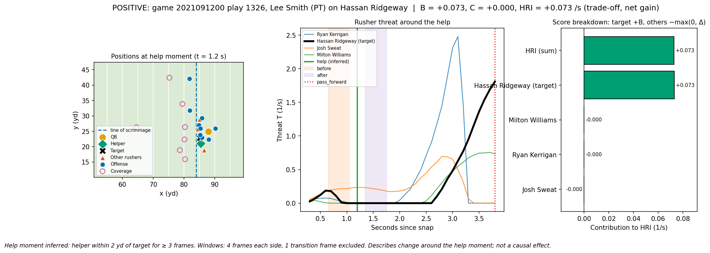
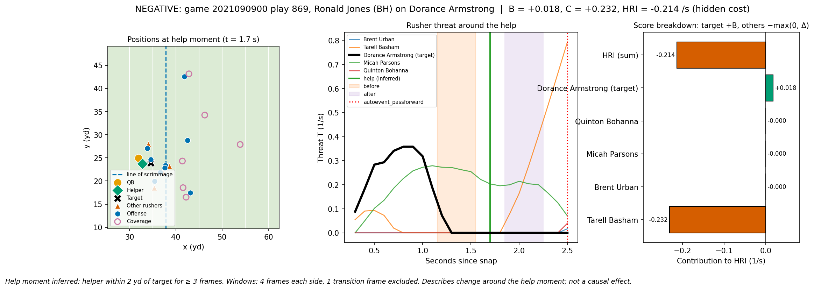

# Help Ripple Index (HRI): Quantifying the Impact of Blocking Assistance on Offensive Line Pass Protection in the NFL

This repository contains `NFL-data-analysis.ipynb`, a Jupyter notebook that demonstrates and calculates the Help Ripple Index (HRI) for National Football League (NFL) American football plays, using 2021 NFL Big Data Bowl player tracking and PFF scouting data. HRI is a metric designed to quantify the ripple effect of blocking assistance on offensive line pass protection. HRI evaluates how, when an offensive player helps block a pass rusher, that rusher's threat to the quarterback changes, and whether other pass rushers become more threatening at the same time. A positive HRI indicates that the drop in threat from the helped-on rusher outweighed any increase elsewhere, while a negative HRI indicates that threat from other rushers increased by more. HRI describes changes in the moments around the help block, not a proven cause-and-effect.

## Positive HRI

## Negative HRI

[Data source](https://github.com/ThompsonJamesBliss/nfl-big-data-bowl-regional-event-data)
